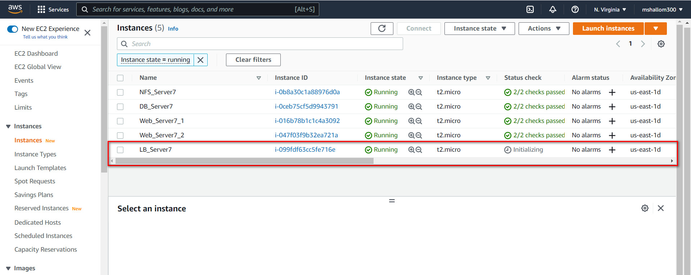
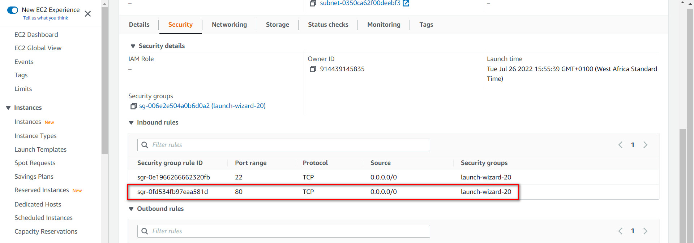
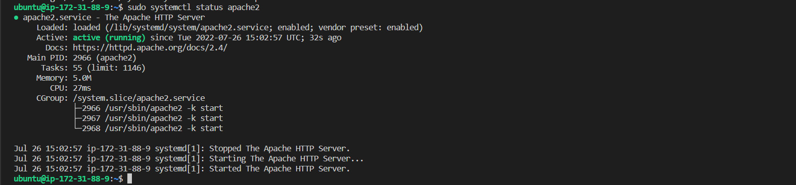

# Load-Balancing-with-Apache

I introduced the concept of file sharing on multiple web servers to access same shared content on an independent external NFS server.

For the website solution implemented, how can we balance users request traffic across the 3 web servers we setup 
([horizontal scaling](https://www.cloudzero.com/blog/horizontal-vs-vertical-scaling#:~:text=Horizontal%20scaling%20(aka%20scaling%20out,server%20may%20be%20your%20solution.))) so as not to put excess load on a single server whilst the others are idle. 

We implement a Load Balancing solution using apache2 so as to handle routing users request to our web servers.


#

# Implementation

Create an ubuntu server which will server as loadbalancer to the webservers


It is important to open up TCP port 80 in the load balancers inbound rule as requests are made through it.



## Installing Packages
Install apache2, libxml and then configure apache for loadbalancing via enabling proxy and proxy_balancer
```
# Installing apache2
sudo apt update
sudo apt install apache2 -y
sudo apt-get install libxml2-dev
```
```
#Enable following modules:
sudo a2enmod rewrite
sudo a2enmod proxy
sudo a2enmod proxy_balancer
sudo a2enmod proxy_http
sudo a2enmod headers
sudo a2enmod lbmethod_bytraffic
```
```
#Restart apache2 service
sudo systemctl restart apache2
sudo systemctl status apache2

```



